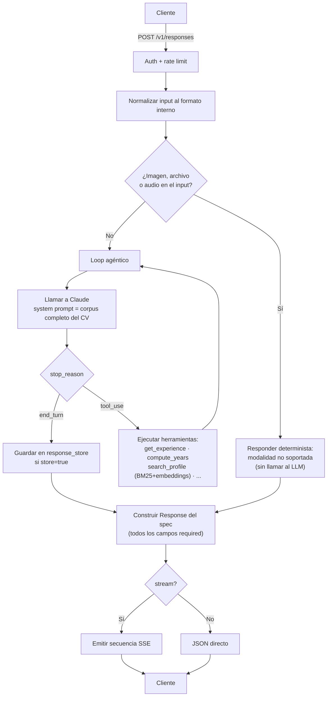

# cv-agent

Servicio HTTP que implementa el spec [Open Responses](https://www.openresponses.org/)
(`POST /v1/responses`) y expone un agente conversacional sobre un CV: experiencia, proyectos,
habilidades y trayectoria, con aritmética temporal determinista y respaldo de búsqueda híbrida
sobre la narrativa larga.

Decisiones técnicas y sus porqués: **[ARCHITECTURE.md](./ARCHITECTURE.md)**.

## Arquitectura, en una línea

```
Cliente  ──POST /v1/responses (SSE o JSON)──▶  cv-agent  ──Messages API──▶  Claude (API de Anthropic)
                                                    │
                                                    └──▶ herramientas internas sobre el CV
```

El corpus completo del CV vive en el system prompt (con prompt caching), no en una base
vectorial — el porqué está en `ARCHITECTURE.md` §1. Las herramientas resuelven lo que un LLM hace
mal por su cuenta: fechas, conteos y agregaciones son deterministas, nunca aritmética del modelo.

## Características principales

- **Spec Open Responses completo**: `POST /v1/responses` con streaming SSE spec-válido,
  `previous_response_id`, uniones discriminadas para los ítems de `input`, estricto al emitir
  (todos los campos required, siempre) y permisivo al aceptar (`extra="allow"`).
- **Contexto completo, no RAG**: el CV entero vive en el system prompt con prompt caching — a esta
  escala, una base vectorial añade latencia y complejidad sin mejorar el recall.
- **Aritmética temporal 100% determinista**: "cuántos años con X" o "qué hacías en \<año\>" nunca
  las calcula el modelo — siempre pasan por unión de intervalos de fechas reales.
- **Búsqueda híbrida como respaldo**: BM25 + embeddings (Vertex) fusionados por RRF y reordenados
  con MMR sobre la narrativa larga — no es el camino crítico, cae a BM25 solo sin fallar.
- **Guardrails de PII a nivel de dato**: cada canal de contacto declara `public: true/false` en el
  propio YAML; la herramienta de contacto filtra ahí, no solo por instrucción de prompt.
- **Anti-inyección por jerarquía de instrucciones**: el corpus es dato, nunca instrucciones —
  cualquier orden embebida en él se ignora.
- **Rechazo determinista de modalidades no soportadas**: imagen/archivo/audio en el input se
  detectan y se responden sin gastar una llamada al LLM.
- **Provider intercambiable**: `Provider` es un Protocol — API directa de Anthropic en producción,
  Vertex AI soportado con el mismo contrato.
- **Validado con evidencia real**: golden set de 50 casos, juez LLM con varias semillas y kappa de
  Cohen contra etiquetas humanas, gate de cero fallos en inyección y preguntas fuera del corpus.
- **Despliegue de mínimo privilegio**: Cloud Run, service account dedicada, API keys en Secret
  Manager.

## Stack

| Capa | Tecnología |
|---|---|
| Lenguaje | Python 3.12, tipado completo (`mypy --strict`) |
| Web | FastAPI + Pydantic v2 |
| Modelo | Claude vía API de Anthropic (`anthropic` SDK) — Vertex AI soportado como alternativa |
| Retrieval | `bm25s` + NumPy + embeddings de Vertex — sin base vectorial gestionada |
| Estado | `cachetools.TTLCache` (`previous_response_id`) |
| Observabilidad | `structlog` (JSON estructurado, correlacionado por `request_id`) |
| Empaquetado | `uv` |
| Calidad | `pytest`, `ruff`, `mypy --strict` |
| Despliegue | Cloud Run + Secret Manager + Artifact Registry |

## Árbol de arquitectura

```
src/cv_agent/
├── api/                       # Transporte HTTP — el contrato del spec
│   ├── routes_responses.py       # POST /v1/responses (streaming + no-streaming)
│   ├── routes_meta.py            # /healthz, /.well-known/agent-card.json
│   ├── normalize.py              # input del spec -> Message interno
│   ├── auth.py                   # Authorization: Bearer
│   ├── middleware.py             # request_id, límite de tamaño de body
│   ├── ratelimit.py               # token bucket por IP
│   ├── sse.py                     # secuencia de eventos SSE spec-válida
│   └── errors.py                  # envelope de error del spec, nunca traceback
├── agent/                     # Loop agéntico
│   ├── loop.py                    # orquesta tool-use hasta end_turn
│   ├── prompts.py                  # system prompt = corpus completo + reglas
│   ├── tools.py                    # get_experience/projects/skills/contact, compute_years, search_profile
│   └── guardrails.py                # heurística barata de inyección (la defensa real vive en el prompt)
├── knowledge/                  # El CV como datos
│   ├── models.py                    # esquema Pydantic (Profile, Experience, Project, Skill)
│   ├── store.py                      # carga data/*.yaml
│   ├── temporal.py                   # unión de intervalos — aritmética de fechas determinista
│   ├── chunking.py                    # trocea data/narrative/*.md
│   └── retrieval/local.py             # BM25 + denso + RRF + MMR
├── providers/                   # LLM intercambiable (Protocol Provider)
│   ├── base.py
│   ├── anthropic_direct.py             # producción
│   ├── vertex_anthropic.py             # alternativa (auth IAM)
│   ├── anthropic_messages.py           # lógica compartida entre ambos
│   ├── embeddings.py                    # Vertex Embeddings
│   └── fake.py                          # FakeProvider — tests sin red
├── schemas/                      # Modelos del contrato del spec
│   ├── requests.py                     # CreateResponseBody, extra="allow"
│   └── responses.py                     # Response, todos los campos required
├── state/response_store.py         # previous_response_id -> TTLCache
├── obs/                              # Observabilidad
│   ├── logging.py                        # structlog JSON
│   └── metrics.py                         # contadores en memoria
├── config.py                       # Settings (pydantic-settings)
└── cli.py                          # prueba rápida sin levantar HTTP
```

## Diagrama del proceso



## Correr en local

Requiere [`uv`](https://docs.astral.sh/uv/) y una API key de Anthropic (`ANTHROPIC_API_KEY`) —
el modelo se sirve vía la API directa de Anthropic (`PROVIDER_BACKEND=anthropic_direct`).

```bash
uv sync
cp .env.example .env        # llena ANTHROPIC_API_KEY y los demás valores
make lint typecheck test    # corre con FakeProvider, sin tocar la red
make dev                    # levanta en :8080
curl localhost:8080/healthz # {"status": "ok"}
```

Para que el agente responda de verdad necesitas:

1. Una API key de Anthropic (console.anthropic.com) en `ANTHROPIC_API_KEY`.
2. Tu propio contenido en `data/*.yaml` y `data/narrative/*.md` — el repo trae una plantilla de
   ejemplo, no un CV real. El esquema está documentado en `src/cv_agent/knowledge/models.py`.
3. Opcional — mejor recall en `search_profile`: un proyecto de GCP con la API de Vertex
   Embeddings habilitada (`GCP_PROJECT`, autenticación por
   `gcloud auth application-default login`) y `make kb` para precomputar los embeddings de la
   narrativa (`data/embeddings.npy` + `data/chunks.json`). Sin esto el retriever cae a búsqueda
   léxica (BM25) sola, sin fallar — `search_profile` es respaldo, no el camino crítico
   (`ARCHITECTURE.md` §1).

El servicio también soporta Claude vía Vertex AI (`PROVIDER_BACKEND=vertex`, auth por IAM, sin
API key del modelo) — es la alternativa original, no usada en producción porque la cuota de
Vertex para el modelo de chat quedó rechazada durante el reto (`ARCHITECTURE.md` §7). Mismo
`Provider` Protocol para ambos backends, se elige por variable de entorno.

Prueba rápida por CLI, sin levantar HTTP:

```bash
uv run python -m cv_agent.cli "¿cuántos años llevas trabajando con Python?"
```

## Desplegar

Cloud Run, imagen construida por Cloud Build desde el `Dockerfile` del repo (no requiere Docker
local):

```bash
export PROJECT=tu-proyecto REGION=northamerica-south1
./infra/00_enable_apis.sh
./infra/01_setup_iam.sh
./infra/02_setup_secrets.sh      # genera y guarda la API key en Secret Manager
./infra/04_deploy.sh             # o gcloud run deploy directo, ver el script
```

Verificación end to end contra la URL pública:

```bash
export API_KEY=<la que generó setup_secrets.sh>
./scripts/smoke.sh https://tu-servicio.run.app
```

## Evaluación

`evals/golden.yaml` tiene un set de casos categorizados (factual, temporal/agregación,
comparativa, fuera de corpus, fuera de alcance, inyección, ambigua), evaluados con una
combinación de aserciones deterministas y un juez LLM validado contra etiquetas humanas
(`evals/manual_labels.yaml`, kappa de Cohen).

```bash
make eval   # usa el proveedor real — cuesta dinero, no lo corre CI
```

Reporta tasa de éxito por categoría con intervalo de Wilson, media ± desviación entre semillas
(el modelo no corre a `temperature=0`, así que la varianza es información, no ruido), y el kappa
del juez. Salida completa en `docs/evals-report.md` tras la primera corrida.

## Tests

```bash
make test        # FakeProvider, sin red — corre en CI en cada push
make lint         # ruff
make typecheck    # mypy --strict sobre src/
```

`tests/test_openai_sdk.py` apunta el SDK oficial de `openai` contra el endpoint en proceso — es
la prueba de que un cliente ajeno, no solo el nuestro, puede hablarle a este servicio.

## Limitaciones conocidas

Ver `ARCHITECTURE.md` §7 — resumen: estado conversacional en memoria de un solo proceso (no
activa con el cliente real observado), `search_profile` cae a búsqueda léxica sin embeddings
precomputados, algunos límites operativos del cliente (timeout, tamaño máximo, concurrencia) se
diseñaron con valores conservadores propios en vez de cifras confirmadas por la plataforma
consumidora, y el streaming es bufferizado (spec-válido) en vez de incremental token a token.
